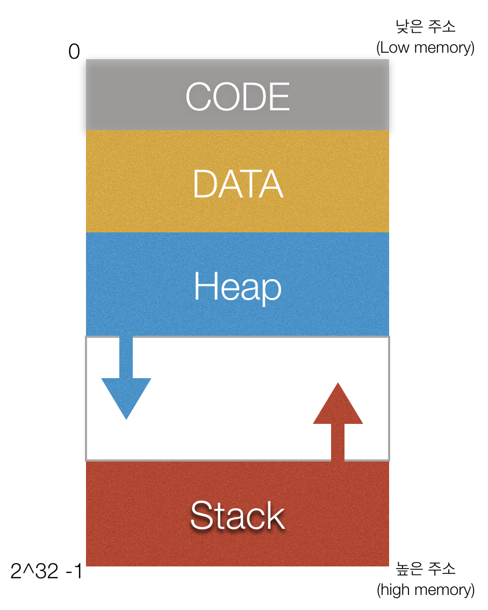

## The Basic

<br>

<br>

<br>

### What can I know?

- 메모리 구조
- Data Unit
- Range
- 로그 출력을 위한 함수 - Free Function
- 주석 - Comments
- Semicolon(;)

<br>

<br>

<br>

### Memory - 메모리의 구조



- CODE - 내가 작성한 코드가 컴파일되어 기계어로 올라가 있는 상태이며, CPU는 CODE 영역에 있는 명령어를 가져가서 실행하게 됩니다.
- DATA - 전역변수, 정적변수가 올라가 있으며, 프로그램이 종료되기 전까지 메모리에 남아 있는 상태입니다. 
- Heap - 할당 해야하는 메모리의 크기를 런타임(프로그램이 실행되는 동안) 결정해야 되는 경우에 사용됩니다. 실행하는 순간 할당을 받아서 사용하고 사용이 완료되면 운영체제에게 돌려준뒤 다시 요구가 오면 재 할당을 받아서 사용하는 공간입니다.
- Stack- 함수 호출 시 지역변수와 매개변수가 할당되는 공간이며, 함수 종료시 제거되게 됩니다. 

<br>

<br>

#### Stack - 정적 메모리 할당

> LIFO, FILO의 컨셉을 가지는 직선형 자료구조를 사용한 메모리 할당

 Stack은 지역변수나 매개변수를 할당하는 공간으로 컴파일 단계에서 메모리 할당량에 대한 계산이을 합니다. method로 사용시에 메모리에 할당되어 사용을 하고 method가 종료되면서 메모리 공간을 반환하게 됩니다. 컴파일 단계에서 메모리 할당량에 대한 계산을 하기 때문에 크기가 정해져있는 타입이며, 메모리의 크기가 하드 코딩이 되어있기 때문에 나중에 조절 할수 없다는 단점이 있습니다.

<br>

<br>

#### Heap - 동적 메모리 할당

> 미리 예약 되어 있는 메모리의 영역

 동적 메모리 할당은 프로그램이 실행되는 동안 사용할 메모리 공간을 할당 하는것을 말합니다. 사용이 끝나면 운영체제가 쓸수 있도록 반납하고 다음에 요구가 오면 재 할당을 받을 수 있습니다. 

 이는 프로그램이 실행하는 순간 사용할 메모리 크기를 고려하여 메모리 할당이 이루어 지는 정적 메모리 할당과 대조적입니다.

 동적 메모리 할당을 사용하면 프로세스의 Heap 영역에서 할당하게 되므로 프로세스가 종료되면 운영체제의 메모리 리소스가 반납되면서 해제되게 됩니다. 그러나 프로레스가 계속 실행되면 동적 할당된 영역은 유지되므로 프로그램이 정해진 힙 영역의 크기를 넘는 메모리 할당을 요구하면 할당이 되지 않습니다.

그래서 사용이 완료 된 영역은 반납하는 것이 유리한데, C/C++과 같이 사용이 완료된 영역을 수집(쓰레기 수집)이 없는 경우는 프로그래머가 함수를 사용해서 해제해주고, 자바와 Swift같은 언어는 메모리를 수거해 갑니다.

그러나 프로세스가 계속 실행될 때에는 도엊ㄱ할당 된 영역은 유지되므로 프로그래미이 정해진 힙 영역의 크기를 넘는 메모리 할당을 요구하면 할당되지 않습니다.

 따라서 사용이 완료 된 영여긍ㄴ 반납을 하는것이 유리한데 C/C++은 프로그

 보통 객체와 배열이 생성되는 공간이며, 참조타입(배열, 열거형, 클래스)들이 Heap영역에 주소형식으로 저장이 됩니다.

<br>

<br>

#### Queue

> LILO, FIFO 컨셉을 가지며, 들어간 순서데로 꺼내 오는 자료구조

값을 추가 하는 것 - Enqueue or Put

값을 꺼내 오는 것 - Dequeue or Get

Real(Back) : Enqueue(값을 넣을때)에 사용될 인덱스

Front : Dequeue(값을 꺼내올때)에 사용될 인덱스

<br>

<br>

### Data Unit

- Bit : 0, 1 / On, Off / True, False와 같이 두 상태만을 표현하며 정보 표현의 최소단위입니다
- 2Bit는 4가지 (0, 0) (1, 1) (1, 0) (0, 1)을 나타낼수 있으며, 3Bit는 3가지 8Bit는 256가지를 나타낼수 있습니다.
- Byte : 기본적으로 1Byte = 8Bit 이며, 문자 하나를 나타내는 최소 단위입니다.

<br>

<br>

### Range

- Int 8 = -(2^7) ~ (2^7) -1
- Uint 8 = 0 ~ (2^8) -1
- Int 32 = -(2^31) ~ (2^31) -1
- UInt 32 = 0 ~ (2^32) -1

<br>

<br>

### 로그 출력을 위한 함수 - Free Function


```swift
var num = 1
print(num) // 1

print("숫자", num) // 숫자 1
print("숫자는 \(num) 이다") //숫자는 1이다
print("숫자" + String(num)) //숫자 1
```

<br>

<br>

### 주석 - Comments


```swift
// : 한줄 주석

/// : 한줄주석 + Quick help Markup

/* */ : 멀티라인 주석
// comment
/* comment
/* comment */
*/
```
Quick Help - (Option-clicking)

<br>

<br>

### Semicolon(;)


Swift에서는 Semicolon을 사용해도 되고 사용하지 않아도 됩니다.

그러나 한 라인에 여러 구문(다중 명령)을 사용하고 싶은 경우에는 세미콜론을 사용해야 합니다.

```swift
print("semicolon"); // semicolon
print("semicolon") // semicolon

print(1); print(2); print(3);
//1
//2
//3
```