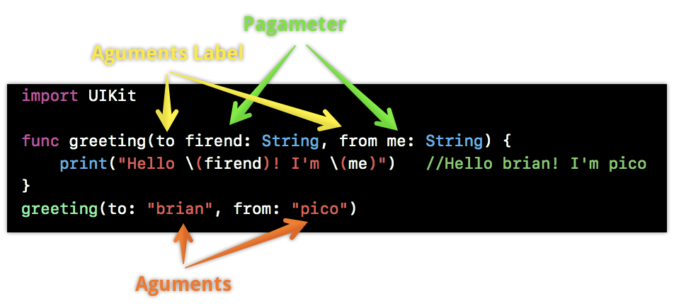

# Function

<br>

## Function


Function은 일련의 작업을 수행하는 코드 묶음을 식별할 수 있는 특정한 이름을 부여하여 사용하는 것을 말합니다.


<br>

### Function 유형


- Input과 Output이 모두 있는것 (Function)
- Input은 없고 Output이 있는 것 (Generator)
- Input은 있고 Output만 없는 것 (Comsumer)
- Input도 없고 Output도 없는 것


<br>

### Function Syntax

```
func functionName(parameterList) -> ReturnType {
	Statements
}
```
```
func greet(person: String) -> String {
	let greeting = "hello, " + person + "!"
    retunr greetiong
}

greet(person: "Anna") // Hello, Anna!
greet(person: "Brian") //Hello, Brian!
```


<br>

### Function with Multiple parameters

```
func addNumbers(a: Int, b: Int) -> Int {
    return a + b
}
addNumbers(a: 3, b: 3) // 6
addNumbers(a: 3, b: 20) // 23
```

<br>

### Argument Label - 전달인자 레이블

함수를 호출할 때 함수 사용자의 입장에서 매개변수의 역할을 좀 더 명확하게 표현하고자 할 때 사용합니다.

또, Swift는 Argument label까지 함수명으로 보기 때문에 전달인자 레이블을 변경하여 동일한 이름의 함수를 중복으로 생성이 가능합니다.

argument label는 외부에서 바라보는 이름이고 parameter는 내부에서 사용되는 값입니다.

```
func greeting(to firend: String, from me: String) {
	print("Hello \(firend)! I'm \(me)")
}
greeting(to: "brian", from: "pico")
```




<br>

### Omitting Argument Labels

arguments는 언더바(_)를 사용해서 생략이 가능합니다.
```
func argumentsLabel (_ parameter: Int) -> Int {
	return parameter
}
argumentsLabel(10) // arguments를 생각하면 parameter값만 넣어주면 된다.
```


<br>

### Parameter에 기본값 넣기

```
func someFunction (parameter1: Int, parameter2: Int = 12) -> Int {
	return parameter1 * parameter2 
}
someFunction(parameter1: 2) //2*12==24
```

<br>

### Variadic parameters - 가변 매개변수

- 전달 받을 값의 개수를 알기 어려울 때 사용합니다.
- 가변 매개변수는 함수당 하나만 가질 수 있습니다.
- 기본값이 있는 매개변수와 같이 가변 매개변수 역시 매개변수 목록 중 뒤쪽에 위치하는 것이 좋을것 같습니다.

<br>

### 사용 방법

```
func arithmeticMead(_ numbers: Double...) -> Double {
    var total = 0.0
    for number in numbers {
        total += number
    }
    return total / 2
}

arithmeticMead(1, 2, 3, 4) //5
arithmeticMead(3, 8, 32, 4, 5) // 26
```

#### variadic parameter외에 다른 parameter를 입력받아서 사용하는 방법입니다.
```
func arithmeticMean(_ numbers: Double..., and last: Double) -> Double {
    print(numbers) //[1, 2, 3]
    print(last) //5
    return last //5
}
arithmeticMean(1, 2, 3, and: 5)
```


```
func arithmeticMead(_ numbers: Double..., count: Double) -> Double {
    var total = 0.0
    for number in numbers {
        total += number
    }
    return total / count
}

arithmeticMead(1, 2, 3, 4, count: 4) //3.3333
arithmeticMead(3, 8, 32, 4, 5, count: 2) // 26
```

variadic parameter를 사용하더라고 aguments label을 잘 선언해줘야 오류가 발생하지 않습니다.

<br>

아래 코드는 aguments label을 정확하게 알 수 없어서 에러가 발생합니다.

```
func artihmeticMean (_ number4: Double..., _ number2: Double) {
    print(number4)
    print(number2)
}
artihmeticMean(1.0, 2.0, 3.0, 4.0, 1)
```

위에 코드가 정상동작을 하려면 aguments label을 알려줘야 합니다.

```
func artihmeticMean (_ number4: Double..., and number2: Double) {
    print(number4)
    print(number2)
}
artihmeticMean(1.0, 2.0, 3.0, 4.0, and: 1)
```

<br>

variadic parameter를 2개 선언해줘도 오류가 발생합니다.(only a single variadic parameter '...')
```
func artihmeticMean (_ number4: Double..., and number2: Double...) {
    print(number4)
    print(number2)
}
artihmeticMean(1.0, 2.0, 3.0, 4.0, and: 1)
```

<br>

### Parameter를 내부에서 변수로 사용하고 싶을때

```
func functionName(name: String, name2: String) {
    var name = name //name 변수 선언
    name += "1" 
    print(name) //"111"
}
functionName(name: "11", name2:"22") //"11", "22" 가 argument
var name = "11"
var name2 = "22"
```
name은 상수(constant)이기 때문에 변수(variable)로 선언 한 다음에 내부에서 사용이 가능합니다.

<br>
<br>

### Function Without Parameters - parameter는 없고 return value가 있는 상태

```
func sayHelloWorld() -> String {
	return ("Hello, World")
}
print( sayHelloWorld() )
```
위의 코드는 Pring("Hello, World")와 결과값이 같습니다.

<br>

### Function without return Value - parameter는 있는데 return Value가 없는 상태

```
func say(number: Int...) {
    print(number)
    return()
}
say(number: 1, 2, 3)
```
```
func say2(number: Int...) -> Void {
    print(number)
    return()
}
say2(number: 1, 2, 3)
```
```
func say3(number: Int...) -> () {
    print(number)
    return()
}
say3(number: 1, 2, 3)
```
위 코드를 보면 return 선언을 생략하거나, Void, ()는 같은 결과값이 나옵니다.

<br>

### Nested Functions - 중첩 함수

함수 내부에서만 사용할 함수를 중첩하여 사용이 가능하게 합니다.

그러나 객체지향에서는 함수는 최대한 간단하게 하는걸 지향하기 때문에 자주 사용하지는 않을것 같습니다.

```
func returnFifteen() -> Int {
    var y = 10  //10
    func add() {
        y += 5 //15
    }
    add() 
    return y //15
}
returnFifteen()
```

<br>
<br>
<br>

## Question

1. 왜 argument label과 parameter laber을 따로 쓰는가?
2. Argument label을 생략하는 경우는 언제인가?

<br>


#### [정답보러가기](https://github.com/JhDAT/Swift/blob/master/Swift/06.Answers%20Function%20Question.md)

<br>
<br>
<br>

## Assignment

 - 이름을 입력 값으로 받아서 출력하는 함수
 - 나이를 입력 값으로 받아서 출력하는 함수
 - 이름과 나이를 입력 받아 자신을 소개하는 글을 출력하는 함수
 - 정수를 하나 입력받아 2의 배수 여부를 반환하는 함수
 - 정수를 두 개 입력받아 곱한 결과를 반환하는 함수 (파라미터 하나의 기본 값은 10)
 - 4과목의 시험 점수를 입력 받아 평균 값을 반환해주는 함수

<br>

#### [풀이보러가기](https://github.com/JhDAT/iOS_Study/blob/master/Swift/playground%20code/FunctionAssignment.playground/Contents.swift)


