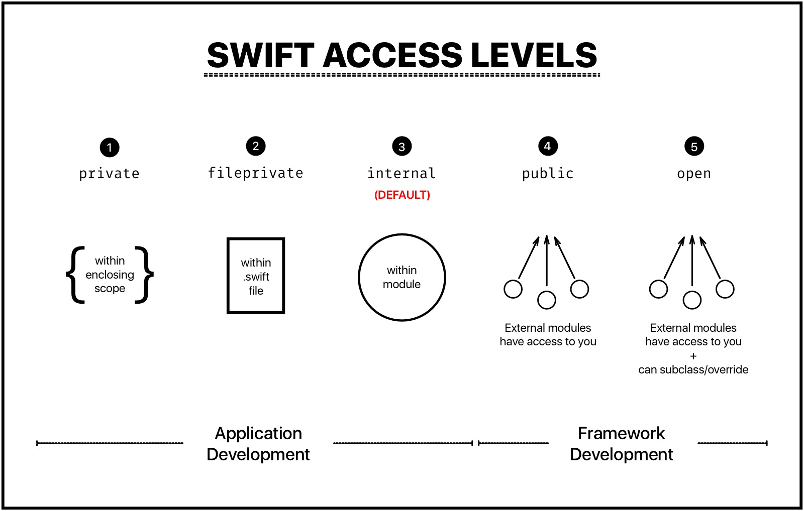

# Access Control

<br>

<br>

<br>

### Access를 제어한다는건

> 다른 모듈의 코드 또는 다른 소스 파일 등으로 부터 접근을 제한하는 것입니다.
>
> 세부 구현 내용을 숨기고 접근할 수 있는 인터페이스 지정이 가능합니다.

- Module(모듈)
  - import를 통해 다른 module로 부터 불러들일 수 있는 하나의 코드 배포 단위를 말합니다
  - Libary / Framework / Application등이 포함 됩니다.
- Source File(소스파일)
  - Module 내에 포함된 각각의 Swift Source code 파일입니다.


<br>

<br>

### Swift Access Levels

> Swift에서는 5가지의 다른 접근 레벨을 제공하고 있습니다.

<br>



1. Private - Scope에 포함되는 것만 접근이 가능합니다.
2. fileprivate - file에 포함되는 것만 접근이 가능합니다.
3. internal - 하나의 모듈에 포함되는 것만 접근이 가능합니다.
4. public - 다른 framwork에 접근이 가능하나 수정을 안됩니다.
5. Open - 다른 framWork에 접근 수정이 가능합니다.

<br>

#### 접근 레벨에 따른 분류

1. open - 가장 개방적
2. public
3. internal - 기본 레벨
4. fileprivate
5. private - 가장 제한적

<br>

<br>

### Access Control Syntax

명시적으로 선언하는 방법입니다. - explicitly 

```swift
open class SomeOpenClass {}	// open
public class SomePublicClass {}	//Public
internal class SomeInternalClass {}	//internal
class SomeClass {}	//internal
fileprivate class	SomeFileprivateClass {} //fileprivate
private class SomePrivateClass {} // private
```

암시적으로 선언하는 방법입니다. - implicitly internal

`internal`이 생략되어 있습니다.

```swift
class ImplicitlyInternalClass {}
let ImplicitlyInternalConstant = 0

internal class ImplicitlyInternalClass1 {}
internal let implicitlyInternalConstant1 = 0
```

<br>

<br>

### Custom Types

자기자신보다 낮은 엑세스 레벨은 내부에서 사용할수 있습니다.

#### Public

```Swift
public class SomePublicClass {
    public var somePublicProperty = 0
    var someInternalProperty = 0
    fileprivate var someFileprivateProperty = 0
    private var someFileprivateProperty = 0
    fileprivate var someFileprivateMethod {}
    private var somePrivateMethod {}
}
```

<br>

#### Internal

```swift
// implicitly internal
class SomeInternalClass {
	var someInternalProperty = 0
    fileprivate var someFileprivateProperty = 0
    private var somePrivateProperty = 0
    fileprivate var someFileprivateMethod {}
    private var somePrivateMethod {}
}
```

<br>

#### Fileprivate

```swift
fileprivate class SomeFileprivateClass {
    fileprivate var someFileprivateProperty = 0
    private var somePirvateProperty = 0
    fileprivate var someFileprivateMethod {}
    private var somePirvateMethod {}
}
```

<br>

#### Private

```Swift
private class SomePrivateClass {
    private var somePrivateProperty = 0
    private var somePrivateMethod {}
}
```

```swift
// private가 전체에 적용 됩니다.
private class SomePrivateClass1 { 
    func somePrivateMethod() { print("야호")}
}
```

```swift
// Scope내에서만 동작하기 때문에 에러가 발생합니다.
class SomePrivateClass1 { 
	private var name = "name"
	private var age = 0
}

let somePrivateClass = SomePrivateClass()
somePrivateClass.name	// 에러 발생
somePrivateClass.age	// 에러 발생
```

<br>

<br>

#### Gatter and Setters - private

Gatter와 Setter는 그것에 속하는 변수, 상수 등에 대해 동일한 접근 레벨을 가집니다. 근데 접근 제한자를 사용해서 Gatter와 Setter에 각각 다른 접근 제한 설정을 할수 있습니다.

여기서는 변수 numberOfEdits의 setter인 set에 private로 접근 제한자를 설정하고 내부에서는 property observer인 didSet을 사용해서 value에 값이 변경되 난 뒤에 numberOfEdits의 변수의 값을 +1 하도록 했습니다.

```swift
// class TrackedString의 value값으로 String이 들어오면 willSet, didSet이 호출됩니다. 
// didSet이 호출되면서 numberOfEdits가 +1씩 되는 클래스입니다.
class TrackedString {
    private(set) var numberOfEdits = 0
    
    //Observer
    var value: String = "" {
        didSet {
            numberOfEdits += 1
        }
    }
}

let trackedString = TrackedString()
trackedString.numberOfEdits			// 0
trackedString.value = "This string will be tracked."
trackedString.numberOfEdits			// 1
trackedString.numberOfEdits	= 1		// 에러발생
```

value에 String값을 생성해주면 didSet이 호출되어 내부의 numberOfEdits의 값을 +1해주게 됩니다. 

그런데 인스턴스화 된 trackedStirng에서 class 내부에 private(set) 되어있는 변수 numberOfEdits의 값을 읽어오는것은 잘 동작하지만 변경하려고 하면 에러가 발생합니다.

에러가 발생하는 이유는 Private는 Scope내에서만 접근이 가능한데 class외부에서 접근을 하려했기 때문입니다. 

이처럼 setter인 set에 private를 줘서 외부에서 값을 읽어갈수 있지만 수정은 할수 없습니다. 이와 같은 방법을 사용해서 건드리면 안되는 데이터를 지정해 줄수 있습니다.

<br>

##### Property observer

- `didSet` 은 property가 변경 된 직후에 호출 
- `willset` 은 property가 변경 되기 직전에 호출


<br>

#### Gatter and Setters - fileprivate

fileprivate는 파일내부까지 접근을 허용합니다. 파일 외부에서 접근하려 할 경우 에러가 발생합니다. 파일 내부에서는 값을 써주는것도 가능합니다.

```swift
class TrackedString {
    fileprivate var numberOfEdits = 0
    
    var value: String = "" {
        didSet {
            numberOfEdits += 1
        }
    }
}

let trackedString = TrackedString()
trackedString.numberOfEdits		// 0
trackedString.value = "This string will be tracked."
trackedString.numberOfEdits		// 1
trackedString.numberOfEdits = 1
trackedString.value += " This edit will increment numberOfEdits."
trackedString.value
trackedString.numberOfEdits		// 2
trackedString.numberOfEdits = 2 
trackedString.value = "value changed"
trackedString.numberOfEdits		// 3
```

<br>

#### Gatter and Setters - public

Public은 모듈내에서 접근이 가능합니다. 모듈외에서 접근해서 사용하려는 경우 에러가 발생합니다. 

```swift
class TrackedString {
    public var numberOfEdits = 0
    
    var value: String = "" {
        didSet {
            numberOfEdits += 1
        }
    }
}

let trackedString = TrackedString()
trackedString.numberOfEdits		// 0
trackedString.value = "This string will be tracked."
trackedString.numberOfEdits		// 1
trackedString.numberOfEdits = 1
trackedString.value += " This edit will increment numberOfEdits."
trackedString.value
trackedString.numberOfEdits		// 2
trackedString.numberOfEdits = 2 
trackedString.value = "value changed"
trackedString.numberOfEdits		// 3
```

<br>

#### Getter와 Setter에 대해 각각 명시적으로 표현

명시적으로 표현해 줄수 있습니다.

```swift
public class TrackedString1 {
    public private(set) var numberOfEdits = 0
//    internal private(set) var numberOfEdits = 0
//    internal private var numberOfEdits = 0	
    
    public var value: String = "" {
        didSet {
            numberOfEdits += 1
        }
    }
    public init() {}
}
let trackedString1 = TrackedString1()
trackedString1.numberOfEdits		// 0
trackedString1.value = "테스트1"
trackedString1.numberOfEdits		// 1
trackedString1.value = "테스트2"
trackedString1.numberOfEdits		// 2
```

<br>

<br>

### Tuple Types

튜플 타입은 자동으로 추론되며 명시적으로 지정이 불가능 합니다. 튜플 유형에 대한 엑세스 레벨은 해당 튜플에 사용된 모든 유형 중 가장 제한적인 엑세스 레벨에 맞춰지게 됩니다.

<br>

### Function Types

함수 유형의 엑세스 레벨은 함수의 매개변수(Parameter) 및 return 유형의 가장 제한적인 레벨로 맞춰지게 됩니다.

함수 선언의 유효성을 위해 함수 반환 유형과 같은 함수의 전체 엑세스 레벨을 표시해야 합니다.

<br>

아래 코드 함수의 반환유형은 튜플로 구성되어 있습니다.

 튜플의 엑세스 레벨은 자동으로 추론되며 명시적으로 지정이 불가능 하다는 특징이 있습니다. 튜플로 구성된 반환유형으로 엑세스 레벨이 internal, private 2개가 들어왔기 때문에 가장 제한적인 엑세스 레벨인 private로 맞춰지게 됩니다.

함수의 선언이 유효하기 위해서는 함수 전체의 엑세스 레벨을 선언해줘야 합니다. 

```swift
internal class SomeInternalClass {}
private class SomePrivateClass {}


// 에러가 발생합니다. 엑세스 레벨이 private으로 추론됩니다.
func returnTupleFunction() -> (SomeInternalClass, SomePrivateClass) {
    // function implementation goes here
    print("A")
    return (SomeInternalClass(), SomePrivateClass())
}

// 정상동작.
private func returnTupleFunction1() -> (SomeInternalClass, SomePrivateClass) {
    // function implementation goes here
    print("A")
    return (SomeInternalClass(), SomePrivateClass())
}

returnTupleFunction1()		// print(A)
```

<br>

아래 코드는 엑세스 레벨을 filepirvate으로 설정 한뒤 실행한 예제입니다.

에러가 발생한 이유는 return유형이 fileprivate로 추정이 되는데 함수는 internal로 선언되어 있기 때문입니다.

그래서 함수를 Private으로 선언을 해주니 정상 동작을 하였습니다. (fileprivate로 선언해줘도 정상동작 합니다.)

```swift
fileprivate class SomeInternalClass {}
fileprivate class SomePrivateClass {}


// 에러가 발생합니다. 엑세스 레벨이 private으로 추론됩니다.
func returnTupleFunction() -> (SomeInternalClass, SomePrivateClass) {
    // function implementation goes here
    print("A")
    return (SomeInternalClass(), SomePrivateClass())
}

// 정상동작.
private func returnTupleFunction1() -> (SomeInternalClass, SomePrivateClass) {
    // function implementation goes here
    print("A")
    return (SomeInternalClass(), SomePrivateClass())
}

returnTupleFunction1()		// print(A)
```

<br>

<br>

### Enumeration Types

Enum의 내부에는 엑세스 레벨을 정해 줄수 없습니다. 

엑세스 레벨이 정해진 enum을 사용 할때는 명시해준뒤에 사용해야 합니다.

```swift
private enum 방위 {
    case 동, 서, 남, 북
}

// 에러가 발생합니다.
enum 방위 {
    private case 동
    private case 서
    private case 남
    private case 북
}
```

let은 기본적으로 internal이기 때문에 명시적으로 표기해줘야 합니다.

```swift
private enum 방위 {
    case 동, 서, 남, 북
}

// 에러가 발생합니다.
let enumeration1 = 방위.남

// 정상동작합니다.
private let enumeration = 방위.남

// "상, 하" 출력
switch enumeration {
case .동, .서:
    print("좌, 우")
case .남, .북:
    print("상, 하")
}
```

<br>

<br>

### 중첩 유형 표시 - Nasted Types

Control Syntax를 참조하면 class 전체에 대해서 엑세스 레벨을 선언해주면 내부에서는 선언된 엑세스 레벨보다 낮은 레벨만 사용할 수 있습니다.

- Private -> private
- fileprivate -> fileprivate
- internal -> internal
- public -> internal
- open -> internal

```swift
public class SomePublicClass {                  // explicitly public class
    public var somePublicProperty = 0            // explicitly public class member
    var someInternalProperty = 0                 // implicitly internal class member
    fileprivate func someFilePrivateMethod() {}  // explicitly file-private class member
    private func somePrivateMethod() {}          // explicitly private class member
}
```

```swift
class SomeInternalClass {                       // implicitly internal class’
	var someInternalProperty = 0                 // implicitly internal class member
    fileprivate func someFilePrivateMethod() {}  // explicitly file-private class member
    private func somePrivateMethod() {}          // explicitly private class member
}
```

```swift
fileprivate class SomeFilePrivateClass {        // explicitly file-private class
    func someFilePrivateMethod() {}              // implicitly file-private class member
    private func somePrivateMethod() {}          // explicitly private class member
}
```

```swift
private class SomePrivateClass {                // explicitly private class
    func somePrivateMethod() {}                  // implicitly private class member’
}
```

<br>

private는 자신이 속한 scope가 범위입니다. 그 외부에서는 사용이 불가능합니다.

```swift
public class SomeInternalClass1 {
    private func SomeInternalClass2 () {
        print("Nasted -1")
    }
}

let someInternalClass = SomeInternalClass1()
someInternalClass.SomeInternalClass2()			// 에러발생
```

<br>

<br>

### Type Aliases

타입에 별칭을 지정해 줄수 있습니다. Type Aliases를 할때도 엑세스 레벨을 지켜가며 해야 합니다.

```swift
class AliasClass {
  let someProperty = 1
}

internal typealias TypealiasClass = AliasClass
let typealiasClass = TypealiasClass()
typealiasClass.someProperty		// 1
```

```swift
class AliasClass {
  let someProperty = 1
}

public typealias TypealiasClass = AliasClass		// internal보다 높은 public여서 에러 발생
```

```swift
class AliasClass {
  let someProperty = 1
}

private typealias Typealiases = AliasClass       // 낮은 레벨이여서 사용 가능
// let typealiases = Typealiases()	// 에러 발생 상수, 변수도 엑세스 레벨을 선언해 줘야합니다.
private let typealiases = Typealiases()
typealiases.someProperty
```

<br>

<br>

