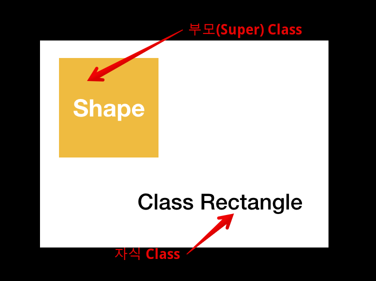

# Type Casting


## Type Check

Data Type에는 여러가지가 있습니다.

```swift
class className {}
var anyArray: [Any] = [1, "2", 3.0]
var anyObjectArray: [AnyObject] = [className()]
var intArray: [Int] = [1, 2, 3]
```

이런 데이터 타입이 궁금할때 확인해 볼수 있는 방법이 있습니다.


### type(of: )

다음 예제는 type(of: )를 사용해서 value 값으로 들어온 값의 타입이 무엇인지를 출력해 주는 예제입니다.

(여기서 T는 Generics로 우선은 어떠한 값이 들어와도 다 받을수 있다 정도만 알면 될것 같습니다.)

```swift
func printGenericInfo<T>(_ value: T) {
  let types = type(of: value)
  print("'\(value)' of type '\(types)'")
}

printGenericInfo(2)		// '2' of type 'Int' 
```

위 Function printGenericInfo의 결과값은 '2' of type 'Int' 입니다.


그럼 추가로 다른 데이터 타입들도 확인해 보겠습니다.

```swift
class className {}
var anyArray = [1, "2", 3.0]
var anyObjectArray: [AnyObject] = [className()]
var intArray = [1, 2, 3]

type(of: intArray)	// Array<Int>.Type
type(of: anyObjectArray)	// Array<anyObject>.Type
type(of: anyArray)	// Array<any>.type
```


### is

is를 사용해서 타입을 비교 할수 있습니다. 기존에 값을 비교하기 위해서는

```swift
"str" == 1	// 값을 비교합니다.
"str" === 1	// 메모리 주소를 비교합니다.
```

위와 같은 방법들을 사용했습니다.

그러나 데이터 타입을 비교하기 위해서는 is를 사용해줘야 합니다.


#### is 사용방법

```swift
var anyArray = [1, "2", 3.0]

if anyArray[0] is Int {
    print("Int")
} else {
    print("else")
}
```

anyArray의 0번에 있는 값이 Int인지 아닌지를 알려주는 if문입니다.

0번의 값은 1이기 때문에 if문 조건이 true가 되고 pirnt("Int")가 출력이 됩니다.


#### 타입 정보 비교를 위한 is

```Swift
var anyArray = [1, "2", 3.0]

// Type의 정비를 가져와서 Int.Type인지를 비교해 주는 is입니다.
if type(of: anyArray[0]) is Int.Type {
    print("Equal")
}

// 에러가 발생합니다. 왜? type(of: anyArray[0])을 출력해보면 Int.Type가 나옵니다.
if type(of: anyArray[0]) is Int {
    print("Equal")
}

// 이건 값이 Int인지를 비교 할때 사용하는 방법입니다.
if anyArray[0] is Int {
    print("Equal")
}

// 이 if문 역시 참입니다.
if 10 is Int {
  print("Equal")
}
```

위에 처럼 값이 Int인지를 비교 해서 사용하려면 is 뒤에 Int를 주면 되고 Data Type을 비교하려면 is 뒤에 Int.Type을 줘야합니다.


#### 상속관계에서의 is

```swift
class Human {
    var name: String = "name"
}
class Student: Hunam {
    var student: String = "student"
}
class Baby: Human {
 	var baby: String = "baby"   
}

let someone: Student = Student()

someone is Human
someone is Student
someone is Baby
```

위의 코드와 같이 Human을 상속받는 Student를 Type으로 가지는 someone를 인스턴스화 했습니다.

인스턴스와 class를 is를 사용해서 비교해봤습니다.

```swift
someone is Human	//ture
someone is Student	//ture
someone is Baby		//false
```

위와 같이 is는 상속받은 Super class와 자신이 해당되는 class에 대해서는 Ture가 나오고 그 외에는 False가 나왔습습니다.

그럼 만들어진 class를 배열에 넣어서 class와 is를 사용해서 비교해보겠습니다.우선 is를 사용해서 배열을 비교하기 전에 확인해 볼게 있습니다.

class가 값으로 들어있는 Array를 만들기 전에 상속 관련해서 확인해 볼게 있습니다.

만약 상속을 받은 class를 type으로 하는 Array를 만들어 준 다음에 Super class를 값으로 넣어주면 들어 갈까요?

정답은 오류가 발생한다입니다.

```Swift
let students: [Student] = [Student(), Human()]		// 에러
let students: [Student] = [Student()]		// 정상	
```

이유는 Student class는 Human Class를 상속 받았기 때문에 Human class에 어떠한 기능이 있고 값이 있는지를 알수 있지만 Human class는 Super class로 자기자신의 값과 기능만 사용할수 있습니다.

그래서 오류가 발생합니다.

그러나 아래와 같이 Array의 Type을 Super class로 주면 Human class와 class를 상속받은 class를 사용 할수 있습니다. 

```swift
//Human Type을 가지는 someArr 배열
let someArr: [Human] = [Human(), Student(), Baby(), Human(), Student(), bany()]
```

is를 사용해서 배열과 클래스를 비교해주면

```swift
class Human {
    var name: String = "name"
}
class Student: Hunam {
    var student: String = "student"
}
class Baby: Human {
 	var baby: String = "baby"   
}

//Human Type을 가지는 someArr 배열
let someArr: [Human] = [Human(), Student(), Baby(), Human(), Student(), bany()]

// someArr[0] - Human()
someArr[0] is Human		// true
someArr[0] is Stuent	// fasle
someArr[0] is baby		// false

// someArr[1] - Student()
someArr[1] is Human		// true
someArr[1] is Stuent	// true
someArr[1] is baby		// false

// someArr[2] - Baby() 
someArr[2] is Human		// true
someArr[2] is Stuent	// false
someArr[2] is baby		// true
```

위와 같은 결과가 나옵니다. 결과를 보면 알수 있듯이 is는 자기자신과 상속받은 Super class에 대해서 Ture를 아니면 False를 반환합니다.


#### Type이 다르면?

이건 class 상속과도 관련이 있습니다.

```swift
class Human {
    var name: String = "name"
}
class Student: Human {
    var student: String = "student"
}

// Type이 Human
var human: Human = Student()
human.name
// Type이 Student
var student: Student = Student()
student.student
student.name
```

위의 코드는 변수 human과 student로 나누어져 있습니다.

여기에 같은 Student() 인스턴스를 넣어줬는데, Type을 1개는 Human, 다른 하나는 Student로 줬습니다.

Type이 다르면 접근할 수 있는 scope가 달리지게 되므로 사용할수 있는 기능이 달라지게 됩니다.


### Type Check Operator

is를 사용해서 For문을 동작시키면 들어있는 값들에 대한 Type Check를 할수 있습니다.

```swift
class Shape {
    var color = UIColor.black
    func draw() {
        print("draw shape")
    }
}

class Rectangle: Shape {
    var cornerRadius = 0.0
    override func draw() {
        print("draw rect")
    }
}

class Triangle: Shape {
    override func draw() {
        print("draw triangle")
    }
}

class Circle {
    var radius = 50.0
    override func draw() {
        print("draw circle")
    }
}

let shape = Shape()
let rectangle1: Shape = Rectangle()
let triangle1: Shape = Triangle()
let circle1: Circle = Circle()

var list: [Any] = [shape, rectangle1, triangle1, circle1]

for elem in list {
    if elem is Shape {   // always true
        print("shape instance")		// 3번실행
    } else if elem is Rectangle {
        print("rect instance")
    } else if elem is Triangle {
        print("triangle instance")
    } else if elem is Circle {
        print("circle instance")	// 1번실행
    }
}
```

```swift
class Circle: Shape {
    var radius = 50.0
    
    func draw() {
        print("draw circle")
    }
}

let circle1: Circle = Triangle()

var list = [shape, rectangle1, triangle1, circle1]

for elem in list {
    if elem is Shape {   // always true
        print("shape instance")		// 4번실행
    } else if elem is Rectangle {
        print("rect instance")
    } else if elem is Triangle {
        print("triangle instance")
    } else if elem is Circle {
        print("circle instance")
    }
}
```


<br>

## Type Casting

우선 4개의 class를 만들어 줬습니다. Shape를 만들고 Rectangle, Triangle, Circle class는 Shape을 상속 받았습니다.

```Swift
class Shape {
  var color = UIColor.black
  
  func draw() {
    print("draw shape")
  }
}

class Rectangle: Shape {
  var cornerRadius = 0.0
  
  override func draw() {
    print("draw rect")
  }
}

class Triangle: Shape {
  override func draw() {
    print("draw triangle")
  }
}

class Circle: Shape {
  var radius = 50.0
  
  override func draw() {
    print("draw circle")
  }
}
```


이들을 Instance화 해주고 그 타입값을 확인해 보면 다음과 같습니다.

```swift
let shape = Shape()
type(of: shape)		//Shape.Type

let rectangle = Rectangle()
type(of: rectangle)	//Ractangle.Type

//Super 클래스가 가지고 있는 값
rectangle.color		// 정상 출력

//자기자신이 가지고 있는 값
rectangel.cornerRadius	// 정상 출력

let triangle = Triangle()
type(of: triangle)	//Triangle.Type

let circle = Circle()
type(of: circle)	//Circle.Type
```

위의 코드 상태를 보면 Super class는 자기자신만 출력이 가능한데, 상속을 받은 class들은 super class와 sub class(자기자신)가 가진 기능과 값을 다 사용합니다.

이해가 어려우면 메모리에서 차지하는 기준으로 봐도 될것 같습니다.

아래 그럼처럼 sub class가 super class를 상속받게되면 super class가 가지고 있는 기능과 값에 자신이 가지고 있는 기능과 값이 추가된 상태로 만들어 지게 됩니다. 그렇게 때문에 sub class는 super class가 어떠한 값과 기능을 가지고 있는지 알아서 쓸수 있는거고 super class는 더 작은 범위기 때문에 자기자신이 가지고 있는 기능만 사용하게 됩니다.



<br>


### Upcasting

> as : 타입변환이 확실 하게 가능한 경우에 사용합니다. 그 외에는 컴파일 에러입니다.

우선 기본적인 표현을 사용해서 Upcasting을 하면 아래의 코드처럼 사용할수 있습니다.

```Swift
let rectangle1: Shape = Rectangle()
type(of: rectangle1)	// Rectangle.Type

let triangle1: Shape = Triangle()
type(of: triangle1)		// Triangle.Type

let circle1: Shape = Circle()
type(of: circle1)		// Circle.Type
```

그리고 Type Check를 해보면 Type은 인스턴스화 된 class의 Type으로 나옵니다.

그러나 각 인스턴스들에게 접근을 해볼려고하면 아래와 같은 결과가 나옵니다.

```swift
// 자기자신의 타입으로 변환
let shape: Shape = shape()
let rectangle1: Rectangle = Rectangle()
let triangle1: Triangle = Triangle()
let circle1: Circle = Circle()

// Super class의 타입으로 변환
let rectangle1: Shape = Rectangle()
//Super 클래스가 가지고 있는 값
rectangle1.color		// 정상 출력
//자기자신이 가지고 있는 값
rectangle1.cornerRadius	// 에러 발생

let triangle1: Shape = Triangle()
triangle1.color		// 정상 출력
triangle1.cornerRadius	// 에러 발생

let circle1: SHaShapepe = Circle()
circle1.color		// 정상 출력
circle1.cornerRadius	// 에러 발생
```

이처럼 상속관계에서 자기자신을 Super class화 시키거나 자기 자신의 타입으로 변하는것을 Upcasting라고 합니다.

또 다른 포현으로는 as를 사용할수 있습니다.

```swift
 let someone: Student = Student()
 let human: Human = someone as Human
```

as는 Type 변환에 실패하면 컴파일이 멈추기 때문에 무조건 확실한 경우에만 사용해야 합니다.


<br>

### Downcasting

Downcasting은 다른 sub class등 super class에서 파생 된 각종 sub class로의 Type 변환을 의미 합니다.

다시 처음으로 돌아가서 Shape class와 상속을 받은 4개의 class를 만들어 주고 Shape Type을 받는 rectangle1을 인스턴스화 하였습니다.

```swift
class Shape {
  var color = UIColor.black
  
  func draw() {
    print("draw shape")
  }
}

class Rectangle: Shape {
  var cornerRadius = 0.0
  
  override func draw() {
    print("draw rect")
  }
}

class Triangle: Shape {
  override func draw() {
    print("draw triangle")
  }
}

class Circle: Shape {
  var radius = 50.0
  
  override func draw() {
    print("draw circle")
  }
}

let rectangle1: shape = Rectangle()
```

그 다음 Rectangle Type을 사용하는 인스턴스를 만들려고 하고 Type으로 shape를 사용해서 인스턴스화를 해주려고 하면

```Swift
let rectangle1: shape = Rectangle()
let shape2: Rectangle = rectangle1
//cannot convert value of type 'Shape' to specified type 'Rectangle'
```

'Shape으로는 지정된 유형은 Rectangle로 convert 할수 없다'라는 오류가 발생합니다.

그때

```swift
let rectangle1: shape = Rectangle()
let shape2: Rectangle = rectangle1 as! Rectangle
shape2.cornerRadius
shape2.color
```

위와 같이 as!를 사용하면 Rectangle Type을 사용할수 있습니다.

as를 쓴다는건 Rectangle 만큼 메모리가 할당되어 있으니 Rectangle 만큼 사용하라는 뜻입니다.

이와 같이 super class (Shape)에서 파생된 Sub class로 변환해서 사용하고 싶을 때는 as! 또는 as?를 사용하면 됩니다.

#### as?, as! 

> as? : 타입변환을 우선 시도해서 나오면 Optional 값을 실패하면 nil값을 반환해 줍니다.
>
> as! : 강제 타입 변환을 시도 합니다. 성공하면 언래핑 된 값이 나오고 실패하면 런타임 에러가 발생합니다.

```swift
let shape2: Rectangle = rectangle1 as! Rectangle
```

이렇게 as! 또는 as?를 쓴다는건 Rectangle 번지만큼 사용하라는 말입니다.

예를들어 원래 범위가 100~200번지까지 사용하고 있었는데, as! 300번지라고 해서 300번지까지 사용해도 된다고 하면 물론 300번지까지 값이 있는 경우도 있겠지만 없는 경우도 있을수도 있습니다. 그럴때 사용하는게 optional입니다.

옵셔널과 마찬가지로 as!는 타입변환을 시도하고 언래핑을 해서 값이 있으면 출력이 되고 실패하면 계속 값을 찾다가 런타임 에러가 발생합니다.

as?는 타입변환을 시도해서 값이 나오면 Optional(값)이 나오고 없으면 nil을 반환해 줍니다.

옵셔널과 마찬가지로 정말 확실하게 값이 나온다고 하면 as!를 사용해도 되지만 웬만하면 as?를 사용하는게 좋을것 같습니다.

그리고 as?를 사용해서 옵셔널 바인딩도 할수 있습니다

```swift
if let downcastedRect2: Rectangle = upcastedRect as? Rectangle {
    print(downcastedRect2.cornerRadius)
}
```

위의 코드는 타입변환을 하고 언레핑을 한다음에 성공하면 print(downcastedRect2.cornerRadius)을 실행 실피해면 nil값을 반환하게 됩니다.


```swift
let val = 1
print(val as Float)   // Compile Error 발생
print(val as? Float)  // nil  //서로 메모리 주소가 달라서 nil
print(val as! Float)  // Runtime Error 발생
```


## Any, Anyobject

Anyobject는 모든 reference type을 허용하고, Any는 모든 Type을 허용합니다.

```swift
class someClass1 {}
class someClass2 {}

var anyArr: [Any]
var anyObjectArr: [Anyobject]

var anyArr = [1, "love", 3.14, someClass1()]
var anyObjectArr = [someClass1(), someClass2(), someClass1(), someClass2()]

anyArray.append("newElement")		// [1, "love", 3.14, someClass1(), "newElement"]
//anyObject.append("newElement")	// 에러

var num = anyArray[0]		
type(of: num)		// Type Check를 해보면 Int.Type
// 그런데 알고보면 var num: Any = anyArray[0] 처럼 써있다고 보면 됩니다.
var num1: Int = anyArray[0]		// 에러 발생 (Int로 나오지만 any type으로 다뤄야 합니다.)


var number1: Int = anyArray[0] as Int

var number2: Int = (anyArray[0] as? Int)!
print(num2)	// 1

var number3: Int? = anyArray[0] as? Int
print(num3)	// Opting(1)

var number4: Int = (anyArray[0] as? Int)! { }

var number5: Int = anyArray[0] as! Int
print(num5)	// 1
```


Any Type으로 선언된 배열에는 .append를 사용해서 값을 추가 할수 있습니다.

Any Type으로 선언된 배열에 값을 가져와서 Type check를 해보면 값이 가지고 있는 Type으로 나오지만,

실제로 사용하려고 할때는 에러가 발생합니다. Any Type으로 선언된 값들은 Any Type으로 다뤄야 합니다.

여기서 Typecasting을 사용하면 Int나 string 같은 Type으로 변환해서 사용이 가능합니다.

### as를 사용

```swift
var number1: Int = anyArray[0] as Int
```

as는 Type 변환이 확실하게 가능한 경우에만 사용해야 하고 그게 아닐 경우에는 컴파일 에러를 발생하게 합니다.

여기서는  anyArray[0] 는 Any type으로 모든 type을 다 받을 수 있기 때문에 해당 배열의 index에 int가 있을지 string, double와 같은 type이 있을지 알수 없게 됩니다. 

그래서 에러가 발생하면서 as? 또는 as!로 downcasting을 권장합니다.

### as!

```swift
var anyArr = [1, "love", 3.14, someClass1()]

var number5: Int = anyArray[0] as! Int
print(num5)	// 1
```

as!는 강제로 타입변환을 시도해서 우선 언레핑을 합니다. 그리고 값이 있으면 값을 반환하고 없으면 런타임 에러를 발생시킵니다.(해당 위치에 가서 계속 찾기 때문에 런타임 에러가 발생합니다.)

위의 예제로 보면 anyArray[0]에는 1이 들어가 있습니다. 강제로 언레핑을 했을때 1이라는 값이 나왔기 때문에 값을 반환하여 출력시켰습니다.

만약

```swift
var anyArr = ["a", "love", 3.14, someClass1()]

var number5: Int = anyArray[0] as! Int
print(num5)
```

위와 같이 1을 "a"로 바꿔주면 Int값이 들어 있었는데 하면서 계속 찾게 되고 결국 런타임에러를 발생하면서 멈추게 됩니다

### as?

```swift
var number3: Int? = anyArray[0] as? Int
print(num3)	// Opting(1)
```

as?는 타입변환을 해서 값이 있으면 Optional값으로 반환해주고 없으면 nil을 반환해 줍니다.

Optional을 언레핑 하고 싶으면 ( )!를 사용하면 값만 나오게 됩니다.

```swift
var number2: Int = (anyArray[0] as? Int)!
print(num2)	// 1
```

이건 예제에 있던 문구인데, 아래와 같이 표시를 하면 에러가 발생합니다.

```swift
var number4: Int = (anyArray[0] as? Int)! { }
```

옵셔널 바인딩을 하려고 해서 값을 꺼내려고 한다면 아래와 같이 하면 됩니다.

```swift
var anyArr = [1, "love", 3.14, someClass1()]
if var number4: Int = anyArray[0] as? Int {
	print(number4)	// 1
}


var anyArr = ["a", "love", 3.14, someClass1()]

if var number4: Int = anyArray[0] as? Int {
	print(number4)	// nil값이 나왔기 때문에 실행되지 않습니다.
}
```


