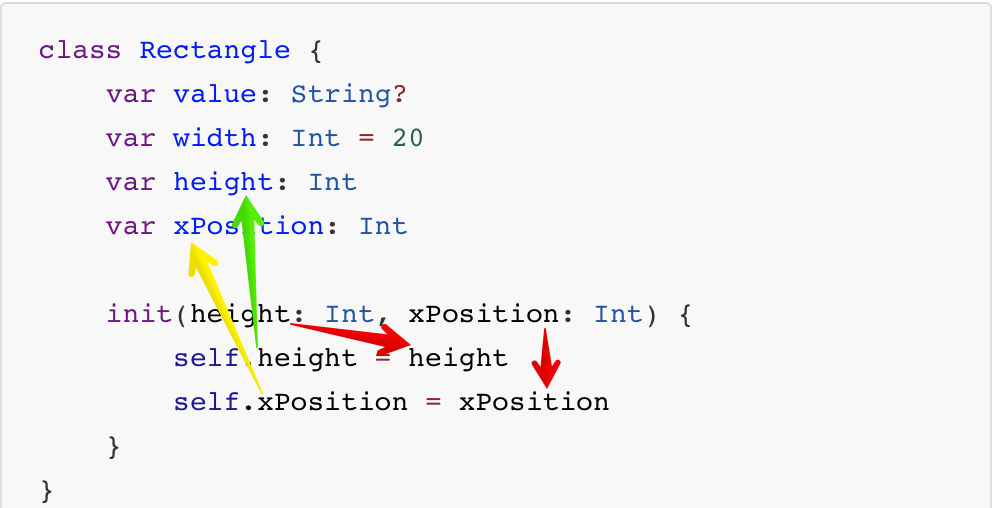

# Initializer


swift의 모든 객체는 사용하기 전 모든 저장 프로퍼티에 대해 초기화가 필수 입니다.

초기화를 하는 방법 3가지는 다음과 같습니다

- 초기값을 지정해 주는 방법
- 옵셔널 -nil 값으로 초기화 하는 방법
- 초기값이 없고, 옵셔널 타입이 아닌 프로터티를 사용해 하는 방법


<br>

## 초기값을 지정해주거나 옵셔널로 초기화 하는 방법

```swift
class Rectangle {
    var value: String?
    var width: Int = 20
}
```

기존에 했던 방법들 입니다. Type 뒤에 ?를 붙여주거나 초기값을 지정해줘서 하는 방법입니다.

<br>

<br>

## 초기값이 없고, 옵셔널 타입이 아닌 프로퍼티를 사용하는 방법

init를 사용해서 초기화 하는 방법입니다.

```swift
class Rectangle {
	var value: String?
    var width: Int = 20
    var height: Int
    var xPosition: Int
    
    init() {
        height = 10
        xPosition = 5
    }
}
```

<br>

init에 parameter를 사용해서 초기화 하는 방법입니다.

```swift
class Rectangle {
	var value: String?
    var width: Int = 20
    var height: Int
    var xPosition: Int
    
    init(height: Int, xPosition: Int) {
        self.height = height
        self.xPosition = xPosition
    }
}

let rect = Rectangle(height: 10, xPosition: 5)
rect.height	// 10
rect.value	// nil
rect.width	// 20
rect.xPosition	// 5
```

<br>

self.height와 init 내부에서 쓰인 height는 다릅니다.

self.는 class에 내부에 선언된 height이고, height는 init안에서 선언된 parameter입니다.



<br>

<br>

## Disignated Initializer

> init와 init(param1: Int, param2: Int) 를 말합니다.
>
> class에 반드시 1개 이상필요로 합니다. (초기화 과정 중 반드시 한 번은 호출합니다.)
>
> 초기화가 필요한 모든 프로퍼티를 단독으로 초기화 가능한 Initializer입니다.

```swift
class Rectangle {
	var value: String?
    var width: Int = 20
    var height: Int
    var xPosition: Int
    
    //init() {
    //	height = 10
    //	xPosition = 5
    //}
    
    init(height: Int, xPosition: Int) {
        self.height = height
        self.xPosition = xPosition
    }
}

let rect = Rectangle(height: 10, xPosition: 5)
```

<br>

<br>

## Convenience Initializer

> 단독으로 모두 초기화 할 수 없고 일부 프로퍼티만 처리한 뒤에 다른 Initializer에 나머지를 위임합니다.
>
> 중복되는 초기화 코드의 방지를 위해 사용합니다.

```swift
class Rectangle1 {
    var value: String?
    var width: Int = 20
    var height: Int
    var xPosition: Int

    convenience init (xPosition: Int) {
        self.init(height: 10, xPosition: xPosition)
    }
}

let rect2 = Rectangle1.init(xPosition: 10)
```

위의 코드는 에러가 발생합니다. convenience는 단독으로 사용할수 없습니다. 무조건 class 내부에 init가 있어야 합니다.

```swift
class Rectangle1 {
    var value: String?
    var width: Int = 20
    var height: Int
    var xPosition: Int
	
	init(height: Int, xPosition: Int) {
        self.height = height
        self.xPosition = xPosition
    }
    
    convenience init (xPosition: Int) {
        self.init(height: 10, xPosition: xPosition)
    }
}

let rect = Rectangle1.init(height: 11, xPosition: 11)
rect.height		//11
rect.xPosition	//11
let rect2 = Rectangle1.init(xPosition: 5)
rect2.height	//10
rect2.xPosition	//5
```

self.init 자신자신을 초기화 하는 Disigneted Initializer을 호출해서 parameter를 넣어주는 작업을 합니다. xPosition에만 값을 주고 싶고 height값에는 관심이 없을때 convenience를 사용해서 초기화를 해주면 xPosition 값은 들어가고 height값은 초기값이 들어갑니다.

만약 self.init(height: 10, xPosition: xPosition)에서 height를 기본값을 없이 동작시키면 어떻게 될까요?

```swift
class Rectangle1 {
    var value: String?
    var width: Int = 20
    var height: Int
    var xPosition: Int
	
	init(height: Int, xPosition: Int) {
        self.height = height
        self.xPosition = xPosition
    }
    
    convenience init (xPosition: Int) {
        self.init(xPosition: xPosition)		// 런타임 에러 발생
    }
}

let rect2 = Rectangle1.init(xPosition: 5)
rect2.height	//10
rect2.xPosition	//5
```

<br>

<br>

## 초기화 과정

결국 모든 초기화 과정은 Convenience -> Convenience -> Convenience -> … -> Disignated 식으로 진행이 됩니다.

중요한건 마지막엔 항상 Disignated가 있어야 한다는 겁니다.

(init의 parameter를 ( _ )를 사용해서 외부 이름 없이 사용이 가능합니다.)


```swift
class Rectangle1 {
    var value: String?
    var width: Int = 20
    var height: Int
    var xPosition: Int
    
    init?(_ height: Int, _ xPosition: Int) {
        guard height > 0 else { return nil }
        self.height = height
        self.xPosition = xPosition
    }
    
    convenience init (xPosition: Int) {
        self.init(10, xPosition)!
    }
    
    convenience init (height: Int) {
        self.init(height, 20)!
    }
}

let rect1 = Rectangle1(height: 20)
print(rect1.height)
print(rect1.xPosition)
```

<br>

<br>

## Failable Initializer

객체 생성시 원하는 초기화 값이 들어오지 않거나 조건에 맞지 않을 때 객체의 생성을 원치 않을때 사용합니다.

옵셔널 값을 반환하게 되며 객체 생성 실패시에는 nil값을 반환합니다.

```swift
class Rectangle1 {
    var value: String?
    var width: Int = 20
    var height: Int
    var xPosition: Int
   
    init?(_ height: Int, _ xPosition: Int) {
        guard height > 0 else { return nil }
        self.height = height
        self.xPosition = xPosition
    }
    
    convenience init (xPosition: Int) {
        self.init(10, xPosition)!
    }
}

let rect = Rectangle1.init(11, 11)
rect?.height		// optional(11)
rect?.xPosition		// optional(11)
rect!.height		// 11
rect!.xPosition		// 11

let rect2 = Rectangle1(0, 11)
rect2?.height		// nil
rect2?.xPosition	// nil

let rect3 = Rectangle.init(xPosition: 5)
rect.height		//10
rect.xPosition	//5
```

<br>

<br>

# 상속받았을때 초기화

다음은 4개의 클래스가 상속받음에 연쇄적으로 클래스를 초기화 하는 규칙에 대한 그림입니다. 이 그림을 보면 몇가지를 알수 있는데, 

- Designated는 Superclass 로부터 Designated를 호출해야 합니다.
- Convenience는 같은 class 내에서 다른 이니셜라이저 호출해야 합니다.
- Convenience는 Designated로 끝맺어야 합니다.

위에서 다른 2개는 알아봤으니 이제 Designated는 Superclass 로부터 Designated를 호출에 대해서 알아보겠습니다.


<br>

<br>

# Super Class Init

sub class는 자기 자신 이외에 super class의 저장 프로퍼티까지 초기화를 해야 합니다. (Designated는 Superclass 로부터 Designated를 호출해야 합니다.)

Super class의 Disignated Initializer가 기본 init 함수 1개만 있을 경우 super.init() 가 호출됩니다. 2개부터는 어떤걸 가르킬지를 정해줘야 합니다.

```swift
class Base {
    var value: String
    var someProperty: String
    
    init() {
        value = "Base"
        someProperty = "someProperty"
    }
    
    convenience init(someProperty: String) {
        self.init()
        self.someProperty = someProperty
    }
}

class Rectangle: Base {
    var width: Int = 20
    var height: Int
    var xPosition: Int
    
    // 부모 class의 기능을 사용할때의 초기화
    override init() {
        height = 10
        xPosition = 5
    }
    
    //값을 받아와서의 초기화
    init(height: Int, xPosition: Int) {
        self.height = height
        self.xPosition = xPosition
    }
    
    //height만 받아와서 초기화
    convenience init(height: Int) {
        self.init(height: height, xPosition: 10)
    }
}


let rect = Rectangle(someProperty: "naver")
print(rect.someProperty)
print(rect.height)
print(rect.xPosition)


let rect2 = Rectangle(height: 11, xPosition: 11)
print(rect2.someProperty)
print(rect2.height)
print(rect2.xPosition)
```

<br>

위의 코드를 보면 Base를 상속받은 Rectangle을 인스턴스화 시키면서 base class에 있는 기능을 사용해보니 override 된 init()값으로 초기화가 되었습니다.

그리고 다시 인스턴스화를 하면서 parameter를 줘보니 입력한 값으로 초기화가 되었습니다.

만약 Base를 상속받은 Ractangle을 인스턴스화해서 base class에 있는 기능을 사용하려고 할때 override 된 초기화가 없었다면 알람이 발생했을 겁니다.

(값을 사용할수는 있는데 초기화가 안되었음으로)

그래서 상속받은 class를 인스턴스화해서 super class의 기능을 사용하러고 할때는 override init를 사용해서 자기자신에 대한 초기화를 해줘야합니다.

<br>

```swift
class Shape {
    var name: String
    var sides : Int
    
    init(sides:Int, named: String) {
        self.sides = sides
        self.name = named
        printShapeDescription()
    }
    
    func printShapeDescription() {
        print("Shape Name :\(self.name)")
        print("Sides :\(self.sides)")
    }
}


class Triangle: Shape {
    var hypotenuse: Int
    
    // Superclass를 초기화 하는 방법
    init(hypotenuse:Int) {
        self.hypotenuse = hypotenuse
        super.init(sides: 3, named: "Triangle")
    }
    
    override func printShapeDescription() {
        super.printShapeDescription()
        print("Hypotenuse :\(self.hypotenuse)")
    }
}
let shape = Shape(sides: 10, named: "shape")
let triangle = Triangle(hypotenuse: 12)
```

위의 코드는 Shape를 상속받은 Triangle class를 인스턴스화 해서 사용할때 Super class의 초기화 값을 바꿔줘서 사용하게 됩니다.

let triangle = Triangle(hypotenuse: 12)을

인스턴스화 하면 init가 호출이 됩니다.

```swift
    init(hypotenuse:Int) {
        self.hypotenuse = hypotenuse
        super.init(sides: 3, named: "Triangle")
    }
```

그러면서 self.hypotenuse = hypotenuse 에 입력된 값을 넣고 

 super.init(sides: 3, named: "Triangle") 를

불러냅니다.

Super.init는 자신의 부모 class인 super class의 init를 불러내게 되므로 아래 코드가 불러와지고

```swift
    init(sides:Int, named: String) {
        self.sides = sides
        self.name = named
        printShapeDescription()
    }
```

이 init를 사용해서 변수를 초기화 하게 됩니다. 초기화가 끝나면 아래 코드를 실행하게 욉니다.

여기서 override는 super class 함수에도 같은 이름의 함수)func printShapeDescription())가 있기 때문에 sub class에서도 사용을 해주려면 적어줘야 합니다.

```swift
    override func printShapeDescription() {
        super.printShapeDescription()
        print("Hypotenuse :\(self.hypotenuse)")
    }
```

호출 된 함수 override func printShapeDescription() 는

super class에 잇는 super.printShapeDescription()를 호출하게 되고 

```swift
    func printShapeDescription() {
        print("Shape Name :\(self.name)")
        print("Sides :\(self.sides)")
    }
```

함수에 print문에 따라 출력을 하고 

```swift
 print("Hypotenuse :\(self.hypotenuse)")
```

위의 print문까지 출력을 하면 마무리를 하게 됩니다.

<br>

과정은 복잡했지만 다시 한번 요약을 해보면

[super.]을 이용해서 super class에 접근 init의 값을 바꾸거나 함수를 호출 할수 있었습니다.

그리고 sub class에서 super class의 기능을 사용하려고 할때를 대비해서 sbu class를 초기화 하는 override init를 해줘야 한다는것도 알수 있었습니다.

<br>

<br>

## 초기화 이전 단계에서 인스턴스 메서드 호출

```swift
class {
init(height: Int, xPosition: Int) {
  self.height = height
  someMethod()          // Error 발생
  self.xPosition = xPosition
}

    func someMethod() {
      print(self.height)
      print(self.xPosition)
    }
}
```

someMethod()는 self.someMethod()로 봐도 되는데, 아직 초기화가 끝나지 않은 상태에서 변수값을 가져다 쓰려고 하니 에러가 발생합니다.

<br>

<br>

# Extension Initializer 

Extension은 class에 기능을 추가로 달아주는 기능입니다.  특징은 Designated로는 추가 할수 없고 Initializer로만 추가 할수 있습니다.


이유는 생각해보면 간단할지도 모르겠습니다. 초기화를 하는 과정에서 converience는 class 내부에서만 접근해서 초기화를 해준다고 했고 Designated로는 class 외부(상속받은) 까지 접근 할수 있다고 했습니다.


그렇게 봤을때 extension은 class 내부에만 접근해서 영향을 주는 기능(원래의 기능에 추가적으로 옵션을 달라준다고 생각하면 이해가 좀 쉬울지도)이기 때문에 Converience로만 초기화를 해 줄수 있습니다.

```swift
class Rectangle {
    var height: Int
    var xPosition: Int
    
    init(height: Int, xPosition: Int) {
        self.height = height
        self.xPosition = xPosition
    }
}

extension Rectangle {
    
    convenience init(height: Int) {
        self.init(height: height, xPosition: 10)
    }
}

let rect = Rectangle(height: 3)
print(rect.height)
print(rect.xPosition)
```

<br>

<br>

# Required Initializer

Required 키워드를 필수 이니셜라이저의 구현 앞에 붙이면 후에 서브클래스 연쇄를 필수적으로 적용된다.

즉 상속받은 클래스에서 반드시 작성해주어야 하는 초기화 메서드가 있을 때 required를 사용하면 됩니다.

Overrider를 사용하면 required 키워드를 사용하지 않아도 됩니다.

```swift
required init(height: Int, xPosition: Int) {
  self.height = height
  self.xPosition = xPosition
}
```

위에서 사용한 override init()와 같은 기능을 한다고 이해하면 될것 같습니다.

<br>

<br>

# Deinitializer

객체가 사라지는 순간이나 할당되었다가 없어질때 deinit 메소드가 호출 됩니다.

```swift
deinit {
  // 객체 메모리 해제 시 동작할 코드
}
```

```swift
class SomeClass {
    deinit {
        print("Deinit")
    }
}
var someClass: SomeClass? = SomeClass() //인스턴스
print(someClass) // 클래스를 print로 할당했다가 없어질때 deinit 호출

someClass = nil
print(someClass) // 값이 nil이라서 할당이 안되서 nil 출력
```

데이터가 다른 곳에 영향을 미칠수 있다고 판단되면 완전히 메모리에서 지워버리거나 메모리를 쓸데없이 가지고 있다고 생각될때 사용됩니다.

<br>

<br>


